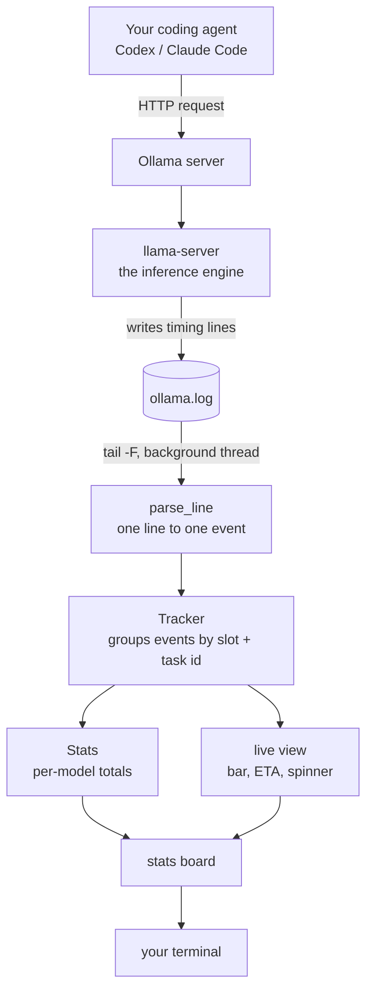
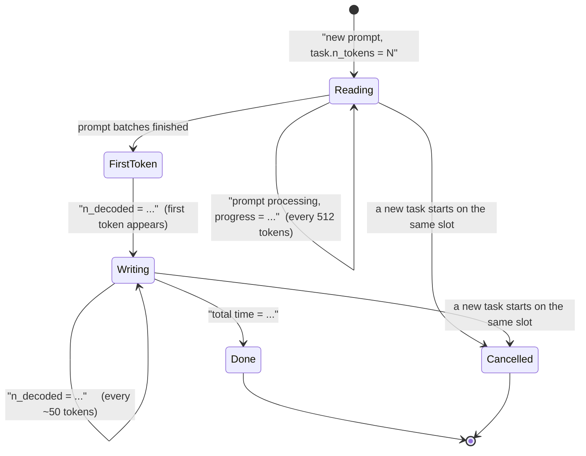

# ollama-llmwatch

**Your local model isn't stuck — it's still reading your prompt.** It shows you that,
live, with a progress bar, an ETA, and a stats board.

```
 llmwatch 0.5.0   qwen3.8:27b-mtp-128k   12 req - 18m04s
PREFILL  peak  114.8   avg   92.3   low   47.2 tok/s   218,442 tok - 39m12s
         ▁▂▃▅▇█▇▆▅▃▂▁▂▃▄▅ last 16
GENERATE peak   17.8   avg   13.1   low    2.7 tok/s     3,110 tok - 3m58s
         ▂▃▄▅▆▇█▇▆▅▄▃▂▁▂▃ last 16
CACHE      68% reused - 149,204 tok never recomputed - 2 full rereads
DRAFT      53% accepted - speculative decoding is paying off
TTFT     min 0.3s - avg 1m52s - max 8m11s (approx: prefill time)
WAIT     ██████████████████░░ 91% of session spent in prefill
SYSTEM   ! swapping 2.5/4.0 GB
── recent ──────────────────────────────────────────────────────────────
  task     prompt      total   prefill speed   share of wait
  2313   14,906 tok    2m47s      89.1 tok/s    98% reading
  2288    6,633 tok    1m26s      77.1 tok/s    97% reading
── live ────────────────────────────────────────────────────────────────
  ⠹ PREFILL ████████░░░░░░░░ 41% 6,144/14,906 tok  101 tok/s  elapsed 1m01s | eta 1m27s
    cache working: only 6,144 of 21,050 tok to read   answer ready ~1m45s
```

---

## The problem, in plain English

When you run a model on your own machine, a request happens in two very different steps.

**Step 1 — the model reads your prompt.** Every message, every file, every tool description
your coding agent sends. Nothing is printed while this happens.

**Step 2 — the model writes its answer.** Now you see text appear.

Step 1 is usually the long one, and it is completely silent. A coding agent like Codex or
Claude Code sends 30,000–55,000 tokens of instructions on *every* turn. On an M1 Max running a
27B model, that's around **eight minutes of reading** before a single character appears — while
the answer itself takes about twenty seconds.

So you sit looking at a spinner with no idea whether the model is working, stuck, or about to
finish. That's the whole problem.

## How llmwatch helps

It sits beside your agent in another terminal and answers the questions the spinner can't:

| you wonder | llmwatch tells you |
|---|---|
| "Is it stuck, or working?" | a bar that moves, updated 10x a second |
| "How much longer?" | a real ETA, counting down |
| "Is it reading or writing?" | separate PREFILL and GENERATE phases |
| "Why was that one so fast?" | how much of the prompt came from cache |
| "Is my machine getting slower?" | peak / average / low speeds, plus a trend line |
| "Which model build is faster?" | stats kept per model, never mixed together |
| **"Should I keep waiting or kill it?"** | **a one-line diagnosis — see below** |
| "Why did it suddenly get slow?" | detects it, and names what's competing |

### The line that helps you decide

Under the progress bar, llmwatch says what's actually going on, in a few words:

```
! cache gone - rereading all 39,528 tok (~6m35s)        answer ready ~7m10s
! same prompt 4x - agent may be stuck in a loop
! 3 cancels in a row - client keeps timing out
long chat: reading 45,000 tok this turn (~7m30s) - consider compacting
! slow: 40 vs 100 tok/s usual - 2 models loaded (34 GB), swapping 3.0/4.0 GB
! same tool error 3x - agent stuck on a broken call
cache working: only 244 of 41,253 tok to read
drafts 22% accepted - MTP is slowing this one down
```

The first one is the big one: if the cache is gone, you're paying full price to re-read
everything, and that's usually the moment to interrupt rather than wait. `answer ready ~7m10s`
estimates when the *whole answer* will be finished — not just when text starts appearing —
using your own measured rates.

## Why not just use an existing tool

Ollama's API doesn't send anything until the model has finished reading your prompt. So every
monitor built on that API — including good ones like
[otop](https://github.com/TiniLLM/ollama-token-monitor) and
[howfast](https://github.com/spinualexandru/howfast) — can only show you step 2.

llama.cpp added a progress field for exactly this
([#14685](https://github.com/ggml-org/llama.cpp/issues/14685)), but Ollama doesn't pass it
through. **The server log is currently the only place this information exists**, and reading it
is what makes llmwatch different.

Use otop if you want a system dashboard. Use llmwatch if you want to know why nothing has
happened for four minutes.


### Why there's no CPU or GPU percentage

Deliberate. On Apple Silicon, generation is **memory-bandwidth bound**: during inference the GPU
sits pinned near 100% and the CPU near idle, whether you're getting 13 tok/s or 8. Those numbers
don't move when performance does, so they'd be decoration. (GPU utilisation also needs
`powermetrics`, which requires sudo.)

What actually costs you throughput, measured on an M1 Max:

| cause | measured effect |
|---|---|
| A second model loaded (50 GB of 64) | ~28% slower |
| Background apps competing for bandwidth | ~20% slower |
| Another process hammering the GPU | ~44% slower |

So llmwatch detects slowdowns from **its own rate measurements** — it already knows the only
number that matters — and then uses cheap, sudo-free signals (loaded models, swap, memory
pressure, load average) purely to explain them:

```
SYSTEM   ! 2 models loaded (34 GB), swapping 3.0/4.0 GB
```

## Setup

Needs Python 3.9+, Ollama running locally, and read access to its log. No other dependencies.

```bash
uv tool install ollama-llmwatch      # or: pipx install ollama-llmwatch
llmwatch
```

Or just take the single file:

```bash
curl -O https://raw.githubusercontent.com/bingcheng45/ollama-llmwatch/main/llmwatch.py
chmod +x llmwatch.py && ./llmwatch.py
```

This installs two commands: **`ollama-llmwatch`** (canonical) and **`llmwatch`** (short alias).
The name is `ollama-llmwatch` everywhere because the bare `llmwatch` is taken on PyPI by an
unrelated cost-tracking project.

It finds your log automatically. If it can't, it prints every location it tried:

```bash
llmwatch --log /opt/homebrew/var/log/ollama.log
LLMWATCH_LOG=/path/to/ollama.log llmwatch
```

### Keys (full-screen mode)

| key | what it does |
|---|---|
| `h` | open/close the help screen — what every phase, column and number means |
| `q` or `ctrl-c` | quit |

The help screen keeps the live line visible, so you never lose sight of a running request just
because you asked what a column means.

### Options

```bash
llmwatch                  # full-screen board
llmwatch --plain          # scrolling single-line output, keeps shell scrollback
llmwatch --last           # summarise the most recent request and exit
llmwatch --json           # one JSON object per event, for status bars and scripts
llmwatch --codex          # also show what Codex is doing (see below)
llmwatch --debug-unparsed # show log lines it failed to understand (for bug reports)
```

### Seeing what your agent is doing (`--codex`)

Ollama's log contains no prompt content, so llmwatch can't know what your agent is up to from
there. Codex, however, records its own activity, and `--codex` reads it:

```
── codex ──────────────────────────────────────────────
  last action  exec_command
               cd ~/ai_projects/memory-chess && rg -lF "useGame" src…
  this turn    10 tool calls
  waiting on   model for 2m29s
```

**Opt-in on purpose.** Unlike the Ollama log, your Codex session file contains real content —
commands, file paths, message text — so llmwatch only reads it when you ask. Two caveats: it's
Codex-specific (not Claude Code), and it's correlated to model activity **by time, not by
request id**, because no shared identifier exists between the two.

## How it works

llmwatch never talks to Ollama's API. It reads the log that Ollama's inference engine
(`llama-server`) already writes, and reconstructs what each request is doing.



### How it knows which request is which

`llama-server` handles requests in **slots**, and every log line is tagged with a slot id and a
task id:

```
slot print_timing: id  0 | task 2313 | prompt processing, n_tokens = 4096, progress = 0.27 ...
                   ^^^^^   ^^^^^^^^^
                   slot    task
```

llmwatch keys everything on `(slot, task)`, which is what lets it stay correct when two models
are loaded and their log lines interleave. A request's life looks like this:



Two details that cause most of the confusion:

- **Cache.** If part of your prompt is already in the server's cache, only the rest is
  computed. llmwatch counts **only the tokens that actually need work**, and shows the cached
  amount separately. Ollama's own progress number counts cached tokens too, which is why a
  naive reading says "96% done" when 10 seconds of work remain.
- **The gap after reading.** Between the last prompt batch and the first output token, the
  server builds logits and validates its cache — and logs *nothing*. llmwatch shows
  `prompt read - waiting for first token` with a running clock, instead of a full bar that
  looks stalled.

### Between log lines

The server writes a progress line only once per 512 tokens — every 5–10 seconds at typical
speeds. Rather than freeze between them, llmwatch projects position from the last measured rate
and repaints 10x a second, clamped so the bar can never claim work that hasn't happened. New
log data repaints immediately.

## Limitations and known issues

Honest list. Please add to it via issues.

- **It cannot show what your agent is doing.** The log contains timings only — no prompts, no
  file names, no tool calls. `Searching for src/store.ts` lives in your agent's own logs, not
  here.
- **It needs local log access.** A remote Ollama server won't work.
- **It depends on an internal log format.** `llama-server`'s lines carry no stability guarantee
  and may change between Ollama versions. Tests run against real captured logs to catch drift.
  If output goes quiet after an upgrade, run `llmwatch --debug-unparsed` and open an issue with
  a sample line.
- **Ollama only** for now. The parser targets Ollama's bundled `llama-server`.
- **Linux (journald) and Docker are experimental** — developed and verified on macOS/Homebrew.
- **TTFT is approximate.** It's measured as prefill duration; the log has no record of when
  your client actually sent the request, so queueing time is invisible.
- **The full-screen board clears when you quit** (that's how alternate-screen apps work). A
  plain-text session summary is printed on exit, and `--plain` keeps normal scrollback.
- **Numbers can snap once** if cache information arrives after a progress estimate has started.
  Self-correcting, but visible.
- **Attaching mid-request** means the prompt size was never seen, so that request shows less
  detail until the next one starts.
- **Very small terminals** (under ~10 rows) fall back to `--plain` automatically.

## Contributing and feedback

Issues and PRs are welcome, including "this number looks wrong" — several of the fixes so far
came from exactly that.

**The most useful bug report** includes your Ollama version (`ollama --version`), your OS, and
a few lines of output from `llmwatch --debug-unparsed`. If the parser mishandles a log format,
a fixture in `tests/fixtures/` plus a test asserting the expected values is the single most
valuable contribution.

```bash
git clone https://github.com/bingcheng45/ollama-llmwatch
cd ollama-llmwatch
python3 -m unittest discover tests -v
```

The code is one file, standard library only, deliberately. `parse_line`, `Tracker`, `Stats` and
the `render_*` functions are pure — they take data and return data — so almost everything can
be tested without a terminal or a running model.

## License

MIT
